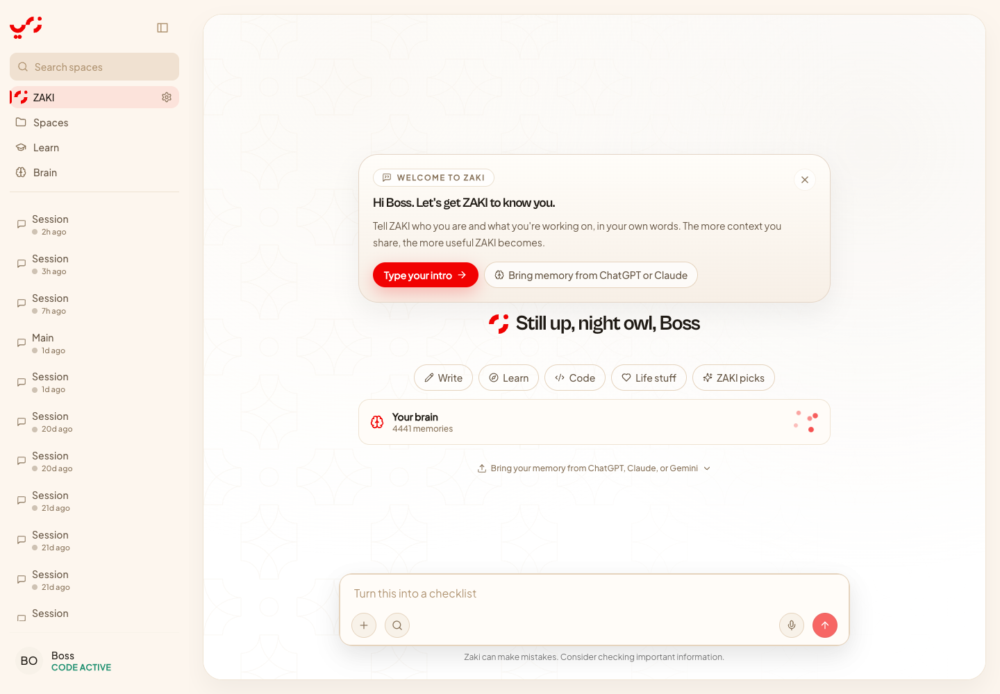
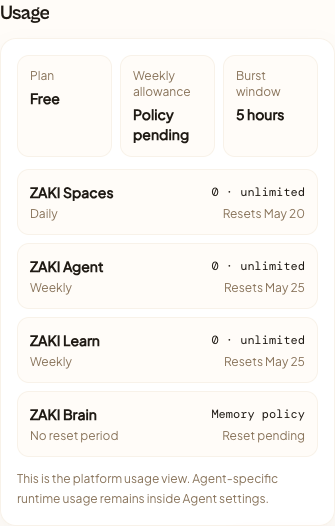
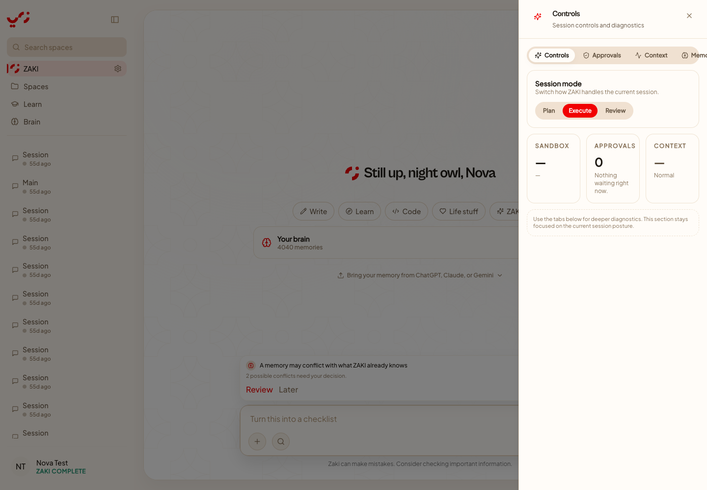
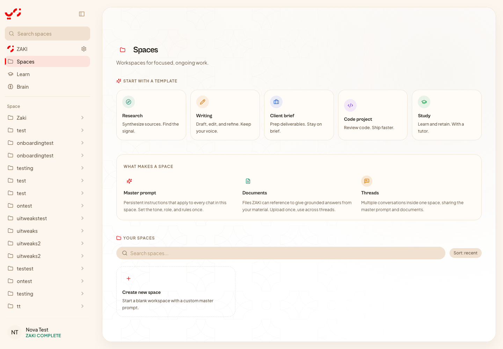
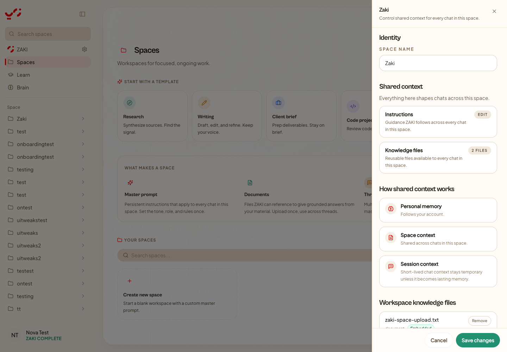
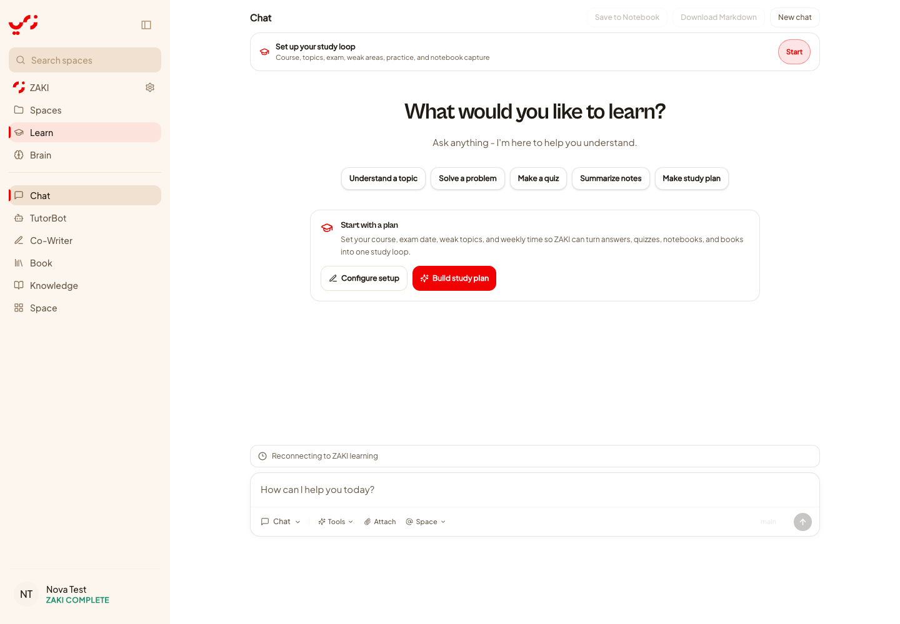
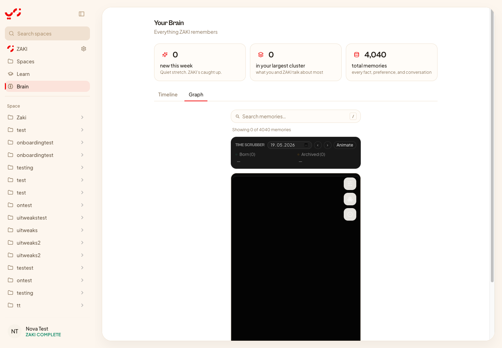

# ZAKI Prod S04 Authenticated UX Baseline Audit

Date: 2026-05-20
Status: Complete, not release ready
Owner: CTO/Product
Scope: authenticated browser validation of Dashboard, Settings, Agent Controls, Spaces, Space Settings, Learn, Brain, and logout.

## Credentials Handling

The local test account was used only through the browser session. The password was not written to this document, scripts, env files, or committed screenshots. Screenshots that exposed account email or login input state were moved out of the repo and are not part of this audit artifact.

## Environment

- Backend: `http://localhost:8787`
- Frontend: `http://localhost:5173`
- Backend health: `ok`, database connected.
- Backend readiness: `not_ready` because the configured learning dependency is unavailable.
- Browser: desktop 1440 x 1024 authenticated flow.

Readiness output during the audit:

```json
{
  "ok": false,
  "status": "not_ready",
  "database": "connected",
  "retryable": true,
  "dependencies": {
    "learning": {
      "ok": false,
      "status": "unavailable",
      "enabled": true,
      "configured": true,
      "error": "fetch failed"
    }
  }
}
```

## Verdict

ZAKI Prod is not ready for production release. The product shells render, the main settings usage surface exists, and the broad route structure is viable. The blocking gap is coherence: auth logout is not actually ending the server session, plan and usage disagree, Learn is configured but unavailable, Agent controls are partially inaccessible, and Brain graph is blank despite a large memory corpus.

The immediate next work should fix correctness first, then information architecture, then visual polish. S-tier polish cannot hide a broken auth/session model or contradictory subscription state.

## Evidence

| Surface | Evidence | Result |
| --- | --- | --- |
| Dashboard |  | Loads authenticated shell, but does not yet behave as the platform command center. |
| Main Settings Usage |  | Usage UI exists, but account entitlement and usage plan disagree. |
| Agent Controls |  | Product-local controls exist, but tab row overflows the sheet. |
| Spaces |  | Route renders and space shell is coherent. |
| Space Settings |  | Space context is explained, but workspace memory governance is not yet actionable. |
| Learn |  | Route renders degraded state while backend readiness is failing. |
| Brain Graph |  | Graph reports 0 visible nodes from 4040 memories and renders an empty black canvas. |

## What Passed

- Authenticated login succeeds in the local environment.
- Core route shells render for `/`, `/spaces`, `/learn`, `/brain`, main Settings, Agent Controls, and Space Settings.
- Main Settings now has a platform usage section for plan, weekly allowance, burst window, and product usage.
- Agent Controls are correctly positioned as product-local session controls rather than global account settings.
- Space Settings already explains personal memory, space context, and session context as separate concepts.
- The backend exposes a `/ready` endpoint with dependency-level status, which is the right production primitive.

## Findings

### P0-01 Auth logout does not revoke the refresh session

Browser result: after clicking Log out, the UI shows Login. Reloading a protected route silently re-authenticates from the existing refresh cookie.

Code truth:

- [src/app/components/Sidebar.tsx](../../src/app/components/Sidebar.tsx:2278) renders the logout menu item.
- [src/app/components/Sidebar.tsx](../../src/app/components/Sidebar.tsx:2281) only closes the menu and calls the client store `logout()`.
- [backend/src/auth-endpoints.js](../../backend/src/auth-endpoints.js:119) already has `POST /api/auth/logout`.
- [backend/src/auth-endpoints.js](../../backend/src/auth-endpoints.js:130) revokes the session row.
- [backend/src/auth-endpoints.js](../../backend/src/auth-endpoints.js:138) clears the refresh cookie.

Why this matters:

This is a production release blocker. A user who logs out must be logged out on the server, across reloads and protected routes. Client-only logout is not acceptable for a commercial app with subscriptions, memory, and future CLI/local clients.

Required fix:

- Add a frontend logout API call to `POST /api/auth/logout` with credentials included.
- Clear the auth store only after best-effort server logout, with fallback local clear if the API fails.
- Clear sensitive query caches on logout.
- Route to a safe unauthenticated page.
- Add an automated regression test for logout followed by refresh/hydration.

Acceptance:

- Clicking Log out revokes the server session.
- Reloading `/brain`, `/learn`, `/spaces`, or `/` after logout does not silently sign the user back in.

### P0-02 Learn is configured but unavailable, and the app is not ready

Browser result: `/learn` renders a reconnecting/degraded shell and the console records repeated 503s for learning endpoints. Backend `/ready` returns `not_ready`.

Code truth:

- [backend/src/index.js](../../backend/src/index.js:2743) probes the configured learning engine during readiness.
- [backend/src/index.js](../../backend/src/index.js:2761) marks learning unavailable on probe failure.
- [backend/src/index.js](../../backend/src/index.js:2779) exposes the aggregate `/ready` endpoint.
- [src/app/components/learning/LearningStudyLoop.tsx](../../src/app/components/learning/LearningStudyLoop.tsx:359) shows "Reconnecting to ZAKI learning" when disconnected.
- [src/app/components/learning/LearningPage.tsx](../../src/app/components/learning/LearningPage.tsx:9627) exposes advanced learning workspaces through the hosted gateway, so this is not a minor auxiliary widget.

Why this matters:

Learn is one of the products in the platform plan model. If it is configured and advertised inside the authenticated product, readiness must either pass or the product must be deliberately gated with clear user and operator language. Repeated failing calls also create noise, cost, and a poor first impression.

Required fix:

- Decide the production mode for Learn in this environment:
  - run and verify the learning engine, or
  - explicitly disable/gate Learn and remove it from ready-required dependency checks for that environment.
- Replace endpoint-by-endpoint 503 flooding with a single product availability state.
- Settings and Dashboard must show Learn availability and quota only when policy and runtime agree.

Acceptance:

- `/ready` is healthy for the intended environment, or intentionally degraded with an operator-visible reason.
- `/learn` either works end to end or shows a controlled unavailable state without a cascade of failing requests.

### P0-03 Plan and usage state disagree for the same account

Browser result: Plan & Billing shows an active code/account entitlement, but Usage shows `Plan Free`, `Weekly allowance Policy pending`, and unlimited per-product counters.

Code truth:

- [backend/src/index.js](../../backend/src/index.js:5859) builds `/api/usage/summary`.
- [backend/src/index.js](../../backend/src/index.js:5864) resolves usage summary from `getEffectiveEntitlementState(zakiUser)` only.
- [backend/src/index.js](../../backend/src/index.js:6688) builds `/api/entitlements`.
- [backend/src/index.js](../../backend/src/index.js:6700) applies `hasLocalUnlimitedQuotaBypass(zakiUser)` for entitlements.
- [backend/src/index.js](../../backend/src/index.js:6736) builds the platform summary after the local bypass has been applied.
- [backend/src/daily-quota.js](../../backend/src/daily-quota.js:127) defines the local unlimited quota allowlist bypass.
- [src/app/components/sidebar/SettingsModal.tsx](../../src/app/components/sidebar/SettingsModal.tsx:372) renders the platform usage section using `/api/usage/summary`.

Why this matters:

Subscriptions, usage, and routing are the central control plane. If two nearby Settings sections disagree, users cannot trust the product and support cannot explain access decisions.

Required fix:

- Create one canonical platform entitlement resolver for account, local access-code bypass, subscription, and product policy.
- Use that resolver in both `/api/entitlements` and `/api/usage/summary`.
- Add a contract test that a code-active/local-bypass account returns consistent platform plan labels across both endpoints.

Acceptance:

- Main Settings Plan & Billing and Usage report the same effective plan/source.
- Dashboard, route gates, and usage summaries read from the same effective platform context.

### P1-04 Agent Controls tabs overflow the sheet

Browser result: Agent Controls opens, but the horizontal tab row extends beyond the right edge. `Memory` is clipped and `Usage` is off-screen at desktop width.

Code truth:

- [src/app/components/agent/PowerUserSheet.tsx](../../src/app/components/agent/PowerUserSheet.tsx:26) defines five tabs: `controls`, `approvals`, `context`, `memory`, and `usage`.
- [src/app/components/agent/PowerUserSheet.tsx](../../src/app/components/agent/PowerUserSheet.tsx:306) renders the tablist as a non-wrapping flex row.
- [src/app/components/agent/PowerUserSheet.tsx](../../src/app/components/agent/PowerUserSheet.tsx:321) gives each tab fixed horizontal padding.
- [src/app/components/agent/PowerUserSheet.tsx](../../src/app/components/agent/PowerUserSheet.tsx:916) uses a medium sheet width.

Why this matters:

The product-local controls are the right concept, but diagnostics are not accessible when the tab row overflows. This also violates the UI bar for production: text and controls must fit inside their containers on desktop and mobile.

Required fix:

- Use a vertical rail for medium sheets, or make the tablist horizontally scrollable with visible affordance and keyboard support.
- Keep product-local controls focused: session mode, approvals, context, memory diagnostics, and agent usage diagnostics.
- Link out to global Settings for billing, plan, OAuth, and global memory policy.

Acceptance:

- All five tabs are reachable at desktop, tablet, and mobile widths.
- No tab label is clipped.
- Keyboard focus order is visible and logical.

### P1-05 Brain Graph is blank despite thousands of memories

Browser result: `/brain?tab=graph` shows `Showing 0 of 4040 memories` and a large empty black graph canvas.

Code truth:

- [src/app/components/brain/BrainPage.tsx](../../src/app/components/brain/BrainPage.tsx:154) loads the initial graph through `useBrainGraph`.
- [src/app/components/brain/BrainPage.tsx](../../src/app/components/brain/BrainPage.tsx:186) reads `total_nodes_in_corpus`.
- [src/app/components/brain/BrainPage.tsx](../../src/app/components/brain/BrainPage.tsx:336) renders the visible/total memory counter.
- [src/app/components/brain/BrainPage.tsx](../../src/app/components/brain/BrainPage.tsx:397) renders the graph frame.
- [src/app/components/brain/BrainGraphView.tsx](../../src/app/components/brain/BrainGraphView.tsx:607) loads graph data again through `useBrainGraph`.
- [src/app/components/brain/BrainGraphView.tsx](../../src/app/components/brain/BrainGraphView.tsx:667) creates the Cytoscape instance.
- [src/app/components/brain/BrainGraphView.tsx](../../src/app/components/brain/BrainGraphView.tsx:968) renders the canvas container.

Why this matters:

ZAKI's agent memory is the product's brain. A blank graph with a non-empty corpus breaks the central promise. This is also relevant to the Spaces memory decision: if personal Brain is the authority, it must be inspectable and trustworthy.

Required fix:

- Trace the graph endpoint payload for the authenticated account and determine why visible nodes are zero while corpus count is non-zero.
- Add an explicit empty-filter/degraded-state explanation when filters hide all nodes.
- Add a smoke test that a seeded memory graph renders at least one visible node or a precise diagnostic state.

Acceptance:

- Brain Graph renders visible nodes for a non-empty corpus, or shows a truthful explanation with a one-click reset.
- The graph canvas is not blank in normal authenticated use.

### P1-06 Dashboard is not yet the platform command center

Browser result: the dashboard/home screen is polished as a ZAKI entry point, but it does not show plan, weekly allowance, burst window, per-product routing state, memory health, or product availability.

Code truth:

- [src/app/components/chat/views/ZakiHomeView.tsx](../../src/app/components/chat/views/ZakiHomeView.tsx:297) defines the authenticated home view.
- [src/app/components/chat/views/ZakiHomeView.tsx](../../src/app/components/chat/views/ZakiHomeView.tsx:432) checks memory conflict status.
- [src/app/components/chat/views/ZakiHomeView.tsx](../../src/app/components/chat/views/ZakiHomeView.tsx:473) renders the home screen, but there is no platform usage/product availability fetch in this component.

Why this matters:

The agreed platform direction is central management of subscriptions, usage, OAuth, and routing to each product. The dashboard must become the user's command center, not only a chat home.

Required fix:

- Add product launch cards for Spaces, Agent, Learn, and Brain.
- Show effective plan, weekly allowance, burst window, and product usage from the platform usage endpoint.
- Show product availability and memory health.
- Keep the visual language minimal and operational, not marketing-heavy.

Acceptance:

- A user can open the dashboard and understand what they can use, how much they have left, and where to go next.

### P2-07 Main Settings sheet is too cramped for production governance

Browser result: the Settings usage/data/privacy sections are present, but the right sheet is narrow and lower content can sit under the footer during scrolling.

Code truth:

- [src/app/components/sidebar/SettingsModal.tsx](../../src/app/components/sidebar/SettingsModal.tsx:372) renders Usage inside the existing settings sheet.
- [src/app/components/sidebar/SettingsModal.tsx](../../src/app/components/sidebar/SettingsModal.tsx:445) starts Data & Privacy immediately after Usage.

Why this matters:

Main Settings is becoming the platform control plane. Billing, usage, memory, OAuth, privacy, sessions, and future developer access need a structure that supports repeated review and support/debug use. A cramped one-column sheet is not enough for the final app.

Required fix:

- Convert Settings into a two-pane settings surface on desktop: left section rail, right content.
- Preserve a sheet or full-screen drawer pattern on mobile.
- Make Usage, Memory/Data, Privacy, Billing, OAuth, and Developer Access first-class sections.

Acceptance:

- No footer overlap.
- Usage and privacy controls remain visible and reachable at desktop and mobile sizes.

### P2-08 Spaces memory governance is explanatory, not actionable

Browser result: Space Settings explains shared context and the distinction between personal memory, space context, and session context. It does not yet provide a direct workspace memory enable/disable/export/delete governance control.

Code truth:

- [src/app/components/sidebar/SpaceSettingsSheet.tsx](../../src/app/components/sidebar/SpaceSettingsSheet.tsx:110) renders Shared context.
- [src/app/components/sidebar/SpaceSettingsSheet.tsx](../../src/app/components/sidebar/SpaceSettingsSheet.tsx:161) renders context summary cards.
- [src/app/components/sidebar/SpaceSettingsSheet.tsx](../../src/app/components/sidebar/SpaceSettingsSheet.tsx:206) renders workspace files.

Why this matters:

The strategic decision is not to delete Spaces memory blindly. We should keep workspace context only if it becomes high-quality, scoped, and governed. The current UI explains scope but does not let users or support control it with production clarity.

Required fix:

- Define Spaces memory as workspace-scoped context, separate from personal Brain memory.
- Add controls to enable/disable workspace memory per space once the canonical memory API exists.
- Add export/delete and provenance visibility through global Memory/Data controls.
- Freeze or migrate ambiguous legacy Spaces memory writes during S13.

Acceptance:

- A user can tell what is personal memory, what is workspace memory, and what is temporary session context.
- Workspace memory has explicit controls and audit trail.

### P2-09 Sidebar scan quality is weak for production-scale accounts

Browser result: the sidebar has many old generic sessions and many test spaces. It works, but it is not a world-class navigation system for a serious account.

Why this matters:

As ZAKI adds products, usage, memory, and future clients, the navigation must help users orient quickly. Dumping stale generic items makes the app feel unfinished and raises support risk.

Required fix:

- Group recent sessions, pinned sessions, spaces, and products.
- Add better empty/loading/error states.
- Add search, recency, and cleanup affordances.
- Virtualize or cap long lists if needed.

Acceptance:

- A production account with many sessions/spaces remains scannable without clutter.

## System Design Implications

The S04 audit reinforces the MECE roadmap:

- Identity is first because logout/session correctness is a hard security and trust boundary.
- Commercial and Usage must share one entitlement context before Dashboard or Settings can be final.
- Product Router needs runtime availability metadata, especially for Learn.
- Memory Control Plane should keep ZAKI Brain as personal memory authority, while Spaces becomes governed workspace context only if it can meet the same quality bar.
- Agent Controls should remain product-local and minimal, but must link clearly to global Settings for plan, billing, OAuth, and global memory policy.

## Immediate Fix Order

1. Fix logout to revoke server session and clear refresh cookie.
2. Centralize effective platform entitlement resolution so Plan and Usage cannot disagree.
3. Decide Learn production mode and remove uncontrolled 503 cascades.
4. Fix Agent Controls tab overflow.
5. Diagnose and fix Brain Graph blank canvas.
6. Move S05 Settings IA into a production-grade two-pane control plane.

## S04 Acceptance Status

S04 is complete as an audit baseline. It is not a production pass.

The route shells were verified, screenshots were captured, and release blockers were identified with source references. The next slice should start by fixing P0-01 through P0-03 before broad visual polish.
